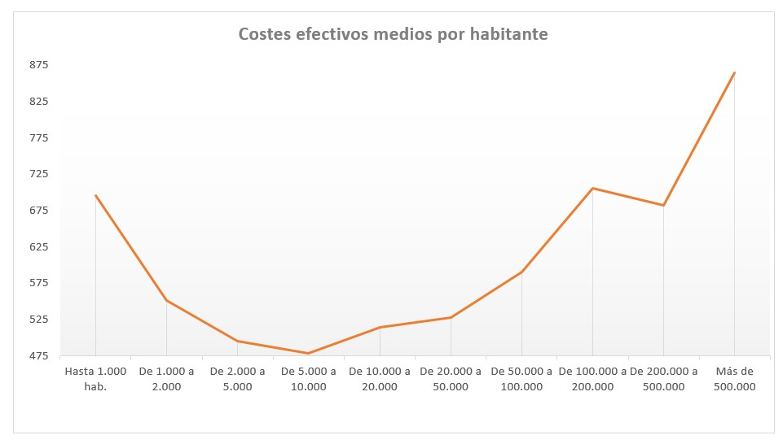

# :house_with_garden: DataTown


---


## :raising_hand: **CESEL DASHBOARD** 

#### CESEL: 
Effective Cost of the Services of the Local Entities(municipality) in Spain, which includes complete and disaggregated information on the number of services provided (measured based on a series of 85 indicators or physical units of reference) and their cost ( disaggregated into 43 municipal competencies or services), covering practically all of the existing municipal services.

This database is managed by the Ministry of Finance (Subdirección General de Estudios Financieros de Entidades Locales de la Secretaría General de Financiación Autonómica y Local del Ministerio de Hacienda) and has its origin in the Law 27/2013, of December 27 that introduced article 116 ter, in the Law Regulating the Bases of the Local Regime of 1985 (Ley Reguladora de las Bases del Régimen Local de 1985).

The database extends to all the Spanish municipalities.


## :chart_with_upwards_trend: **URL** 


### [DataTown](https://www.datatown.es/)  
#### https://www.datatown.es


## :floppy_disk: **Data:**

There are 2 different datasource involved:

- **CESEL.** [Here](https://serviciostelematicosext.hacienda.gob.es/sgcief/Cesel/Consulta/mapa/ConsultaMapa.aspx) you can find the main dataset.

- **INE.** [Here](https://www.ine.es/dynt3/inebase/es/index.htm?padre=517&capsel=525) you can find the population of each municipality in Spain.


## :newspaper: **Insights:**

### Goal

The process known as “benchmarking” (copying from the best) has been revealed as an important tool to improve results in the provision of public services. As its most important advantages have been pointed out (Philips, 2018):

• Objectively evaluate the performance of the public sector

• Reveal areas where improvement is needed

• Identify the best performing regions, municipalities or suppliers and improve the dissemination and adoption of "best practices"

• Check if pilot projects and certain technologies have been successful

• Assist in the preparation of government budgets at the central and sub-central level

• Hold governments and service providers accountable to citizens and establish a common yardstick that encourages competition

This process requires a series of phases (Phillips, 2018):

• Capture information.

• Generate meaningful comparisons or case studies.

• Distribute information through a network of stakeholders, often across multiple levels of government.

The work tries to advance in the second phase (generate meaningful comparisons) by observing an interactive dashboard, based on the information contained in CESEL. The dashboard can serve as a guide so that municipalities can compare themselves with the average values of their population stratum, so that they can serve as “benchmarking” in order to optimize the use of resources and check that they are in line with preferences of its citizens.

### 2018

85% municipalities in Spain have less than 5000 citizens and represent 12% of the population.

Average costs per inhabitant are U-shaped, with land in municipalities being 5,000 to 10,000 inhabitants.



Therefore, this is in opposition to Law (Ley 27/2013 de Racionalización y Sostenibilidad de la Administración Local ), which established the figure of 20,000 citizens as the figure to be considered in order to promote the voluntary merger of municipalities.
This aggregation measure would only save costs for municipalities with less than 2,000 and to a very small extent for municipalities with 2,000 to 5,000 citizens, only 2.5 million citizens.

##### Bibliography:
LEAH PHILLIPS. (2018) Improving the Performance of Sub-national Governments through Benchmarking and Performance Reporting. OECD Working Papers on Fiscal Federalism No. 22

## :see_no_evil: **Usage**

### Getting Started

#### Running the app locally

First create a virtual environment with conda or venv inside a temp folder, then activate it.

```
virtualenv venv
# Windows
venv\Scripts\activate
# Or Linux
source venv/bin/activate
```

Clone the git repo, then install the requirements with pip

```
git clone https://github.com/carpiero/DataTown.git
cd /DataTown
pip install -r requirements.txt
```

Run the app

```
python app.py
```

### Built With

- [Dash](https://dash.plot.ly/) - Main server and interactive components
- [Plotly Python](https://plot.ly/python/) - Used to create the interactive plots


## :art: **Screenshots**

The following are screenshots for the app in this repo:


## :computer: **Technology stack**

- Python==3.7.3
- pandas==1.0.3
- geopandas==0.8.1
- dash==1.13.4
- numpy==1.18.1
- plotly==4.8.2
- gunicorn==20.0.4
- pyarrow==0.17.1


## :file_folder: **Folder structure**
```
└── DataTown
    ├── __trash__
    ├── assets
    │    ├── github.svg
    │    ├── readme.gif
    │    ├── resizin_scrpt.js
    │    ├── s1.css
    │    ├── styles.css
    │    ├── CM.jpg
    │    └── Madrid.jpg
    ├── data
    │    ├── main_processed
    │    ├── main_raw
    │    ├── main_raw_exce
    │    └── main_temp
    ├── notebooks
    ├── o_raw_acquisition
    │    ├── __init__.py
    │    └── m_raw_acquisition.py
    ├── p_acquisition
    │    ├── __init__.py
    │    └── m_acquisition.py
    ├── p_graphic
    │    ├── __init__.py
    │    └── m_graphic.py
    ├── p_pivot_hard_load
    │    ├── __init__.py
    │    └── m_pivot_hard_load.py
    ├── .gitignore
    ├── app.py
    ├── controls.py
    ├── main_script.py
    ├── Procfile
    ├── README.md
    └── requeriments.txt
    
    
```


